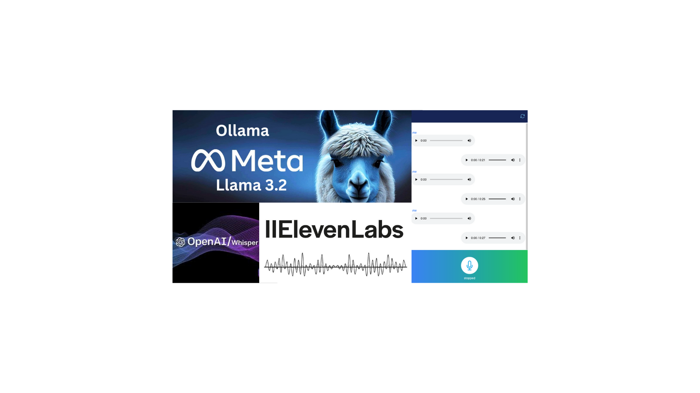

# AI Interview ChatBot

## Overview

The **AI Interview ChatBot** is an advanced voice-enabled chatbot application designed to assist users in preparing for job interviews. Developed using React for the frontend and FastAPI for the backend, this application leverages OpenAI's GPT-4 model to simulate realistic interview scenarios, providing users with interactive practice sessions.

## Features

- **Voice Interaction**: Engage in mock interviews using voice commands, enhancing the realism of the practice sessions.
- **Text Interaction**: Supports traditional text-based input for users who prefer typing.
- **GPT-4 or llama Integration**: Utilizes OpenAI's GPT-4 or llama model to generate context
- **Real-Time Processing**: Ensures prompt responses to user inputs, maintaining a seamless conversational flow.

### Prerequisites

- **Node.js**: Ensure that Node.js is installed on your system. You can download it from [nodejs.org](https://nodejs.org/).
- **Python**: Python 3.8 or higher is required. Download it from [python.org](https://www.python.org/).
- **OpenAI API Key (optional)**: Obtain an API key from [OpenAI](https://platform.openai.com/) to access GPT-4 services.
- **Eleven Labs API Key**: For voice interaction capabilities, obtain an API key from [Eleven Labs](https://elevenlabs.io/).
- **FAST API**: FastAPI is a modern, high-performance web framework for building APIs with Python 3.8 and above.

### Usage
**Voice Interaction:** Click the microphone icon to start recording your message. Release the icon to send the recorded message.